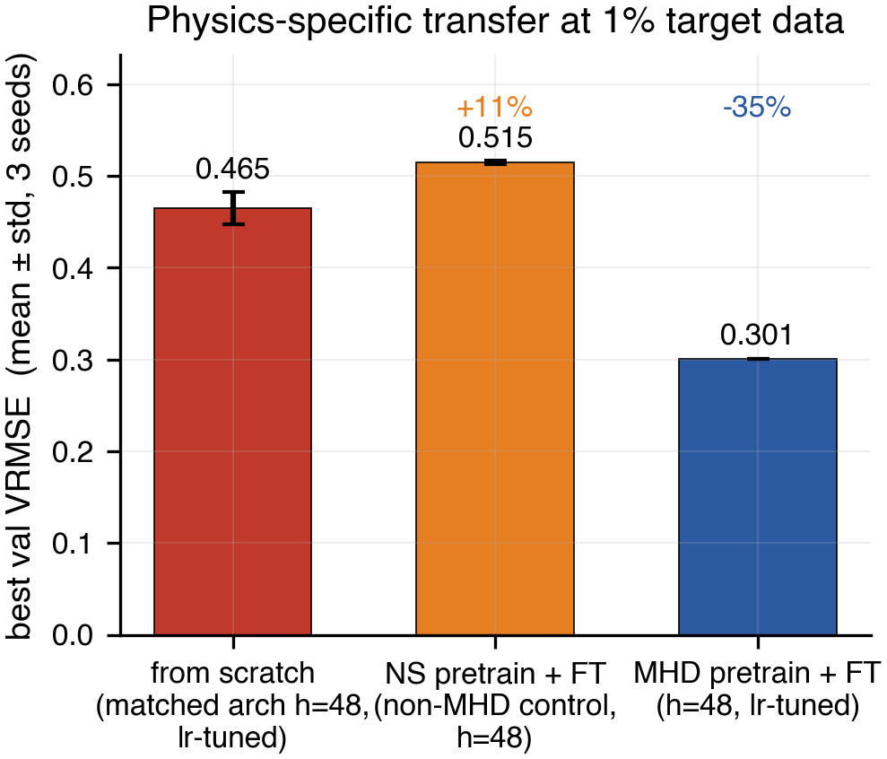

# well-work

<p align="center">
  <a href="p1/paper/main.pdf">
    
  </a>
</p>

<p align="center">
  <em>In-domain MHD pretraining cuts validation error by 35% at 1% target data. Pretraining on the wrong physics (supernova hydro, same architecture) hurts by 14%. Source corpus matters.</em>
</p>

<p align="center">
  📄 <a href="p1/paper/main.pdf"><b>Paper (PDF)</b></a>
  &nbsp;·&nbsp;
  📝 <a href="https://sdelaurentiis123.github.io/posts/plasma-with-claude.html"><b>Blog post</b></a>
  &nbsp;·&nbsp;
  📁 <a href="p1/paper/figures/">Figures</a>
  &nbsp;·&nbsp;
  📐 <a href="p1/paper/main.tex">LaTeX source</a>
</p>

---

Experiments on Polymathic's **The Well** for plasma-turbulence foundation-model
work, in the context of Stan's PhD.

**Pretraining Transfer for Neural MHD Surrogates: What Generalizes, What Doesn't, and Why It Matters for Plasma Foundation Models** — small workshop writeup of the P1 study below. Companion [blog post](https://sdelaurentiis123.github.io/posts/plasma-with-claude.html) covers how the paper got built with Claude Code in the loop.

## P1 — Transfer study: ISM-regime MHD → fusion-regime MHD

**Thesis.** Does pretraining a neural PDE surrogate on the Well's isotropic,
super-Alfvénic MHD turbulence (`MHD_64`, `M_A = 2.0`) transfer to the
anisotropic, sub-Alfvénic, strongly-magnetized regime (`M_A = 0.7`) that's
qualitatively closer to fusion plasma — and if so, *where* in k-space does the
transfer help vs hurt?

**Why it matters.** If transfer works, The Well becomes a legitimate
pretraining corpus for fusion surrogates. If it fails, the failure modes
(fields, scales, anisotropy) tell us what a plasma-focused foundation-model
training distribution needs.

**Metrics.**
- VRMSE on next-state prediction (the Well's default)
- Isotropic power spectrum `E(k)` error on ρ, |v|, |B|
- Anisotropic spectrum `E(k_∥, k_⊥)`
- Autoregressive rollout stability

See `PROJECTS.md` for the broader project roster and `p1/` for the P1 code.

## Layout

```
p1/
  sanity_load.py    # day 1: stream MHD_64 from HF, inspect shapes
  sanity_plot.py    # day 1: plot a slice + parameter grid
  sanity_train.py   # day 2: FNO3D trains 6 steps on MPS
  (more to come: train.py, eval_spectral.py, configs/)
PROJECTS.md         # full project roster (P1-P5)
```

## Environments

- **`mlvenv/`** — local dev (M1 Max, MPS): `torch`, `the_well`, `neuraloperator`,
  `matplotlib`. Python 3.11.
- Full training runs go on a rented GPU (Vast.ai 4090 typically). See
  `p1/setup_remote.sh` once it lands.

TORAX lives in a separate sandbox at `~/torax-sandbox/` (different ecosystem,
different venv, different goals — not part of this repo).
