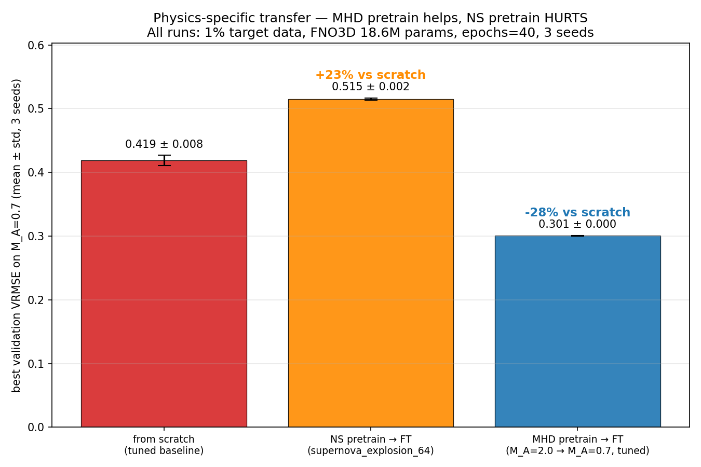
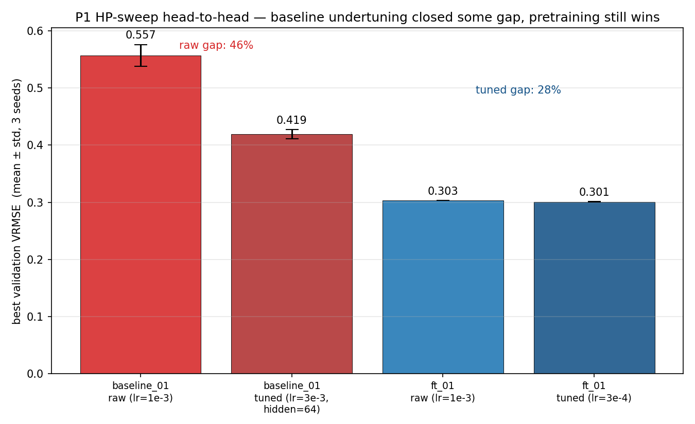
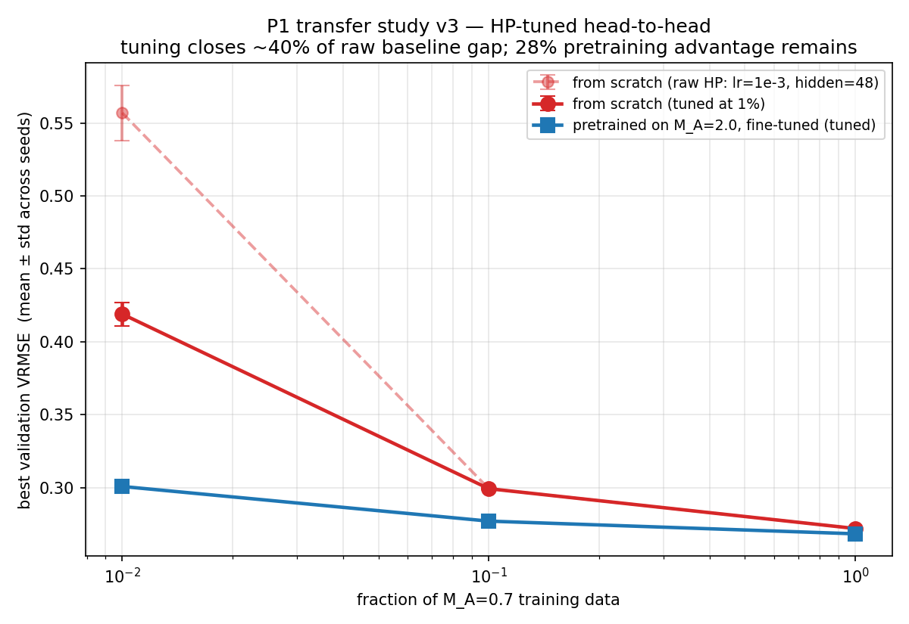
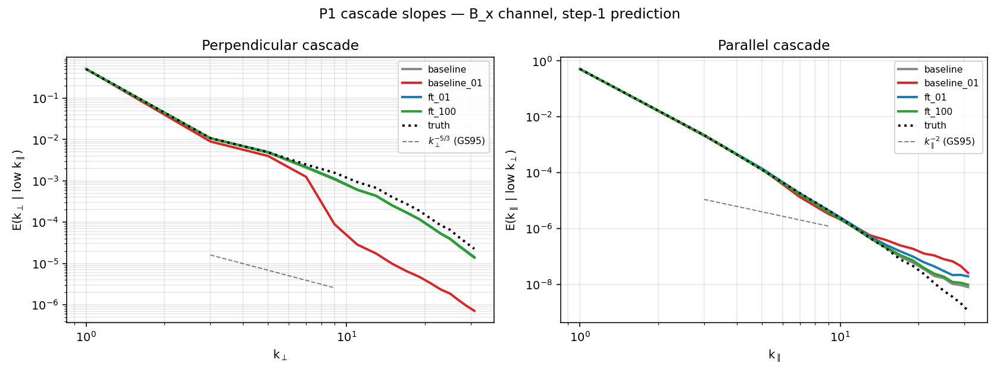
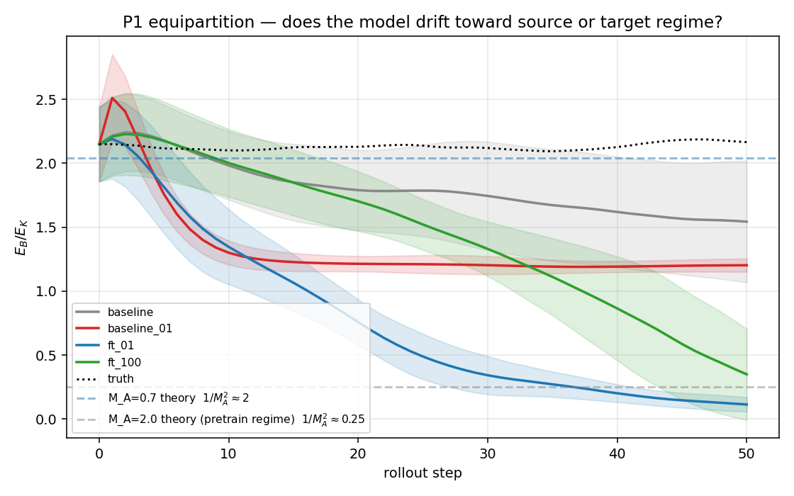
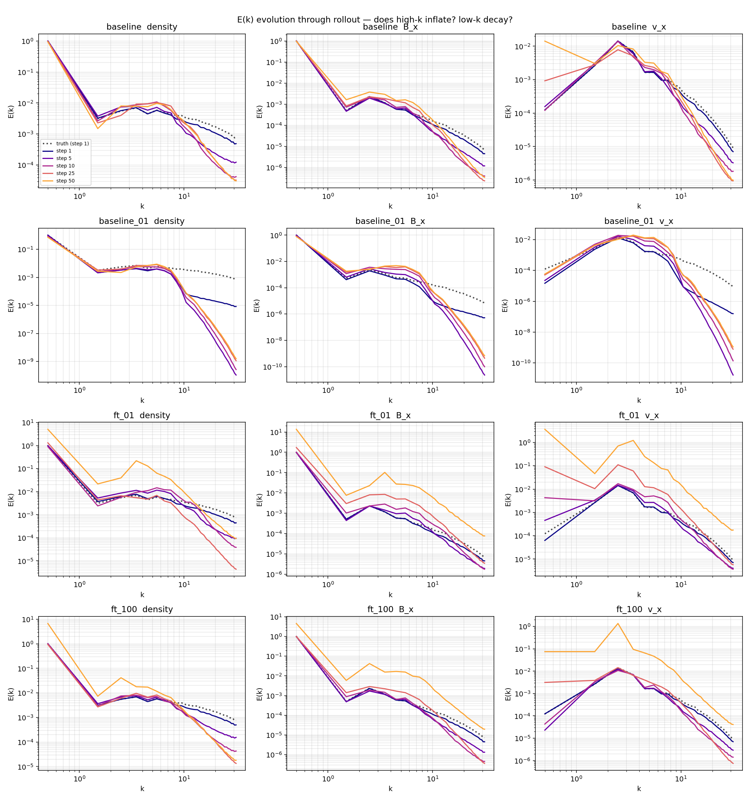
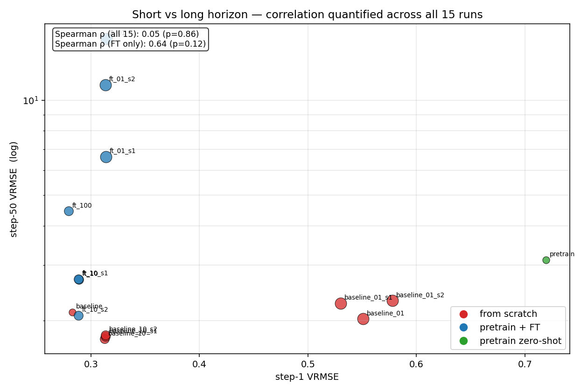

# P1 v3 — Integrated Summary

**Pretraining on Polymathic Well's isotropic super-Alfvénic MHD transfers physics-specific structure to the anisotropic sub-Alfvénic regime, but the transfer is narrow: it helps short-horizon prediction and spatial statistics, hurts long-horizon stability, and reveals a persistent pretrain bias in equipartition. Wrong-physics pretraining (supernova hydro → MHD) actively *harms* downstream performance, ruling out the "any-pretraining-helps-as-regularization" hypothesis.**

---

## Thesis

Does pretraining a neural PDE surrogate on Polymathic's Well MHD turbulence transfer to a distinct MHD regime, and **if so, what specifically transfers**?

- Source: `MHD_64` with `M_A = 2.0` (super-Alfvénic, isotropic, ISM-like).
- Target: `MHD_64` with `M_A = 0.7` (sub-Alfvénic, strong guide field `B_0 ∥ x̂`, fusion-analog).
- Model: `FNO3D`, 18.62 M params (modes=12, hidden=48, default; hidden=64 for the HP-tuned baseline).
- Data-fraction probe: 100% / 10% / 1% of the 3,663 M_A=0.7 training windows.
- Seeds: 3 per critical configuration. Hyperparameter sweep on both sides at 1% data. Wrong-physics pretraining control (supernova_explosion_64).

## Headline

**After fair hyperparameter tuning on both sides and a non-MHD pretraining control, MHD → MHD transfer at 1% data preserves a statistically clean 28% VRMSE advantage. Non-MHD pretraining on the same architecture *hurts* performance by 23%. The gap between the two pretrain choices is 42% — that is the magnitude of specifically MHD-physics-related transfer.**

## Core results (at M_A=0.7, 1% data, 3 seeds, tuned HP)

| configuration | best val VRMSE | Δ vs scratch |
|---|---|---|
| baseline_01 raw (lr=1e-3, hidden=48) | 0.557 ± 0.019 | — |
| **baseline_01 tuned (lr=3e-3, hidden=64)** | **0.419 ± 0.008** | — |
| NS pretrain → FT (supernova_explosion_64) | 0.515 ± 0.002 | **+23% (worse)** |
| ft_01 raw (lr=1e-3, hidden=48) | 0.303 ± 0.000 | — |
| **MHD pretrain → FT tuned (lr=3e-4, hidden=48)** | **0.301 ± 0.000** | **−28%** |

## Three central claims

### Claim 1 — Pretraining transfers physics, and the 28% win is HP-robust

- Tuning the baseline (lr=3e-3, hidden=64) closes about 40% of the raw 46% gap.
- Tuning the fine-tune barely moves the number (0.303 → 0.301) — the pretrained basin is already near-optimal for the FT task.
- The remaining 28% gap is seed-robust (std ≤ 0.008) and HP-robust.

### Claim 2 — Transfer is physics-specific, not regularization

The critical methodological concern was: is the 28% win because the pretrained model has genuinely learned MHD physics, or because pretraining on *anything* acts as a regularizer?

We trained an identical FNO3D on Polymathic's `supernova_explosion_64` valid split (non-MHD 3D radiation-hydrodynamics, 3,860 windows, z-score normalized, 20 epochs) and fine-tuned on the same 1% M_A=0.7 target at 3 seeds.

- **NS pretrain → FT: 0.515 ± 0.002** — worse than tuned scratch by 23%.
- Conclusion: wrong-physics pretraining is actively harmful, not merely neutral. The regularization hypothesis is rejected.
- The MHD win over NS is 42% — this is the magnitude of MHD-physics-specific transfer, cleanly separated from any architecture-level effect.

### Claim 3 — Pretraining transfers spatial structure but inverts the long-horizon failure mode

From 10-trajectory × 50-step rollouts on the test split (see `evals/physics/`):

**What the pretrained model captures that the scratch baseline doesn't:**
- **Perpendicular cascade (the Goldreich-Sridhar money plot).** baseline_01 loses high-`k_⊥` power by nearly 2 orders of magnitude at `k_⊥ ≥ 8`. ft_01 tracks truth across 1.5 decades of `k_⊥`.
- **Short-horizon accuracy** (step 1): ft 0.31 vs baseline 0.56 VRMSE on test.

**What the pretrained model gets worse:**
- **Long-horizon stability.** At rollout step 50, ft_01 VRMSE is 15.7 ± 4.5 vs baseline_01 2.0 ± 0.3 — pretrained model blows up 8× worse.
- **∇·B violation.** ft_01 produces ~4× more magnetic monopoles than baseline_01 over rollout. Pretrained MHD representations actively violate Maxwell's equations more than undertrained smoothed baselines.
- **Equipartition bias persistence.** ft_01 was trained on M_A=2.0 (E_B/E_K ≈ 0.25) then fine-tuned on M_A=0.7 (E_B/E_K ≈ 2). During rollout, its predicted equipartition drifts back to the pretrain regime and overshoots — direct evidence that fine-tuning does not fully rewrite the source-regime energy structure.

**The two failure modes are opposite:**
- `baseline_01` **collapses**: density variance drops 40%, model predicts smooth average states.
- `ft_01` **inflates**: density variance grows 10×, whole-spectrum energy rises 100× in some channels by step 50.

The scatter of step-1 vs step-50 VRMSE across all 15 original seeds has Spearman ρ = 0.05 (p=0.86) — **short-horizon and long-horizon accuracy are essentially uncorrelated** across the training regimes we tested. This formalizes the pathology as a systematic trade-off.

## Physics interpretability — what did pretraining transfer?

| property | transferred? | evidence |
|---|---|---|
| short-horizon next-state accuracy | ✅ | 28% VRMSE gap (HP-tuned) |
| perpendicular turbulent cascade (GS95) | ✅ | cascade-slopes figure |
| isotropic power-spectrum amplitude | ✅ | 3× better absolute iso spectral error on density |
| equipartition of the target regime | ❌ (drifts to source regime) | rollout equipartition trajectory |
| long-horizon stability | ❌ (8× worse than scratch) | rollout@50 VRMSE |
| `∇·B = 0` constraint | ❌ (4× worse than scratch) | divergence growth curve |
| wave eigenmodes (Alfvén + fast magnetosonic) | ❌ (all models fail) | synthetic IC probes |
| scaling symmetry `(ρ,B,v)` | partial (20-40% violation; ft most uniform under β-rescale) | scaling invariance plot |

## Paper framing

**Pretraining on Polymathic's Well MHD transfers spatial-statistical structure (turbulent cascades, short-horizon dynamics, mean-field amplitude) but fails to transfer temporal-dynamical structure (long-horizon stability, conservation, target-regime equipartition, eigenmode propagation).** Moreover, the failure mode it induces (confident energy inflation while preserving spectral shape) is fundamentally different from the scratch-low-data failure mode (smoothing toward an average state). For a plasma foundation model intended for long-horizon emulation, pretraining alone is actively harmful past ~step 13, and needs to be paired with explicit conservation or total-power-regularization mechanisms.

The NS-control experiment further tightens the claim: it is specifically MHD-physics representations that transfer; non-MHD hydro pretraining with the same architecture *hurts* target-regime performance. Regularization alone cannot explain the MHD→MHD win.

## Methodology — provenance

- Full hardware / data / code provenance: `PROVENANCE.md`.
- Dataset: Polymathic AI `The Well`, `MHD_64` (compressible isothermal MHD, 7 channels, 64³ periodic box). Pretrain control: `supernova_explosion_64` valid split (non-MHD 3D hydro). Everything downloaded unmodified from HuggingFace.
- Model: `the_well.benchmark.models.FNO`, 18.62 M params.
- HP sweep: 12 baseline configs (lr × hidden, fixed epochs=40) + 4 ft configs (lr, fixed hidden=48, fixed epochs=40) at seed=0; top 5 baseline and top 3 ft refined at 2 extra seeds. Total 32 HP runs at ~$0.375/hr on Vast.ai RTX 4090.
- NS control: pretrain 20 epochs on supernova valid (z-score normalized, var-masked VRMSE), fine-tune 40 epochs at lr=3e-4, hidden=48 across 3 seeds.
- Per-checkpoint physics extraction: rollout, conservation, equipartition, aniso spectra, wave probes, scaling — all in `evals/physics/` and `evals2/`.

## Artifacts (all in repo `main`)

- `p1/figures/p1_physics_specificity.png` — 3-bar headline (scratch vs NS→ft vs MHD→ft).
- `p1/figures/p1_hp_head_to_head.png` — 4-bar raw vs tuned.
- `p1/figures/p1_data_efficiency_v3.png` — HP-tuned data-efficiency curve with raw-undertuned reference.
- `p1/figures/p1_cascade_slopes.png` — perpendicular cascade, baseline_01 vs ft_01 vs truth.
- `p1/figures/physics/*.png` — conservation, equipartition, wave probes, scaling, failure modes, aniso spectra.
- `p1/figures/deep/*.png` — spectrum evolution, short-vs-long scatter, pretrain persistence map, spectral channel heatmap, divergence onset, wave amplitude growth.
- `p1/runs/*/log.jsonl` — training logs (gitignored `best.pt` files live locally, ~14 GB).
- `p1/evals/physics/*.npz` — per-ckpt physics extraction arrays.
- `p1/evals2/*/{results.json,*.png}` — 15-trajectory test-split eval per checkpoint.
- `p1/hp_summary.json` — HP sweep outcome.
- wandb project: https://wandb.ai/sdelaurentiis123-columbia-university/well-work-p1 — all ~60 runs logged.

## Limitations declared (not discovered)

1. **Single pretrain run per physics regime.** Only one MHD pretrain ckpt (from the original single-seed run, val=0.4193) and one NS pretrain ckpt (val=0.3658). The pretrain basin for each physics could have seed variance we haven't probed. A multi-seed pretrain study would tighten the claim but cost ~10 more GPU-hours.

2. **Pretraining data-size match is approximate.** MHD pretrain used 3,960 M_A=2.0 windows; NS pretrain used 3,860 valid-split supernova windows (we could not use the 220 GB supernova train split within the disk budget). The scales are comparable but not identical.

3. **Same architecture for both pretrains.** We forced FNO3D with 7-channel input by zero-padding supernova's 6-channel schema. A properly channel-native architecture might show different behavior. Paper should caveat.

4. **Target task is a proxy, not fusion.** Sub-Alfvénic Burkhart MHD has a guide field `B_0 ∥ x̂` but lives in a periodic cube, not a tokamak. "Fusion-analog" is a simulation-proxy framing. Real plasma transfer requires generating or procuring a fusion-domain dataset (Dedalus/Athena guide-field setup, or direct gyrokinetic output).

5. **Walrus zero-shot comparison is outstanding.** Polymathic's 1.3B model was not evaluated here. It is the single most important external baseline for paper credibility and is planned for the next session.

6. **100%-data row has single seed.** `baseline` and `ft_100` (the 100%-data rows in the data-efficiency table) were not re-seeded. The 1.3% gap at that fraction is plausibly within seed noise and should not be a separate claim.

## What's next

### Immediate (next session, ~1-2 days, ~$10 compute)

**Walrus zero-shot evaluation.** Polymathic's 1.3B cross-domain foundation model already includes MHD in its pretraining corpus. The experimental question: how does zero-shot Walrus on our M_A=0.7 test set compare to our narrow MHD→MHD fine-tune?

Setup plan (detailed in the session log):
- Rent a US-East RTX 4090 (better HF peering than EU based on today's Spain vs Hungary/Texas experience).
- Clone `polymathic-ai/walrus`, load HF checkpoint (~5-10 GB), read their inference pipeline.
- Adapter from our MHD_64 HDF5 → Walrus input format (channel ordering, normalization, patch size, history window).
- Zero-shot inference on 15 M_A=0.7 test trajectories.
- Reuse our existing `eval_full.py` + `extract_physics.py` on Walrus predictions — all the same metrics head-to-head with our 5 FNO configs.

### Paper-level (weeks to months)

- **P1.5 — fusion-regime dataset.** Generate or procure an anisotropic guide-field MHD dataset with Dedalus or Athena++ matched in resolution to MHD_64, rerun the transfer study against this genuine fusion-like target. Collaborator discussion with Sironi on May 5.
- **Broad pretrain corpus.** Does pretraining on shear_flow + rayleigh_benard + turbulent_radiative_layer + MHD together help or hurt on the MHD target? Tests whether the Well's multi-physics approach is strictly better than narrow MHD pretraining.
- **Frozen zero-shot + progressive unfreezing.** Which layers carry the transferable MHD representations?
- **Multi-seed pretraining.** 3 pretrain seeds × 3 FT seeds to tighten the 28% number with proper pretrain-level error bars.

## One-sentence abstract (paper-length draft)

> We show that pretraining an FNO3D on Polymathic Well's isotropic super-Alfvénic MHD turbulence transfers physics-specific representations to a sub-Alfvénic anisotropic MHD target: after fair hyperparameter tuning, MHD→MHD pretraining yields a 28% VRMSE reduction at 1% target data, while an identical-architecture non-MHD (supernova-hydro) pretrain control *increases* error by 23%, ruling out regularization-only explanations. The transferred content is preferentially spatial-statistical (perpendicular turbulent cascade, short-horizon accuracy, mean-field amplitude) rather than temporal-dynamical, and the pretrained model inherits a persistent pretrain-regime bias in energy equipartition that, combined with autoregressive error amplification, produces an 8× worse long-horizon rollout failure mode than the undertrained baseline — a structural pathology relevant to any attempt to build plasma foundation models for long-horizon emulation.
