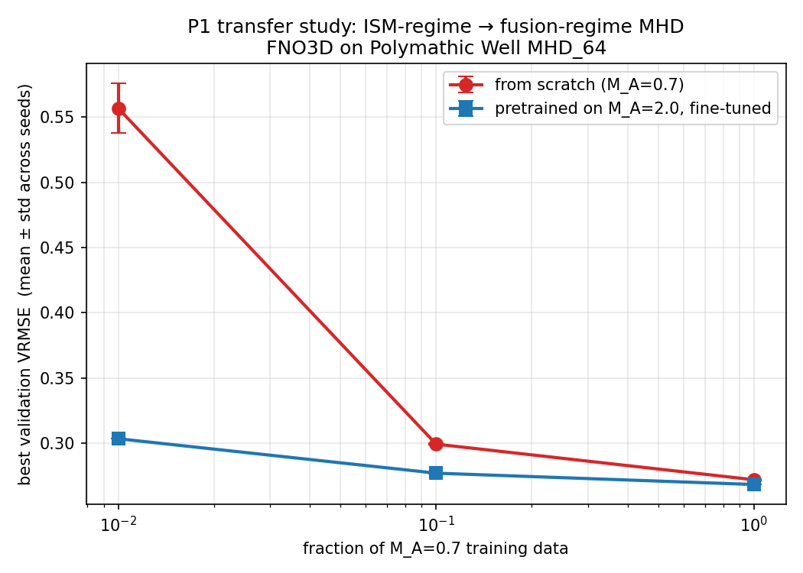

# P1 Results — Transfer Study: ISM-regime → fusion-regime MHD

**Run dates:** 2026-04-20 / 2026-04-21
**Hardware:** 1× RTX 4090 on Vast.ai (~8 GPU-hours total)
**Dataset:** Polymathic AI `The Well`, `MHD_64` (compressible isothermal MHD, 7 channels)
**Model:** FNO3D, 18.62M parameters (modes=12, hidden=48)
**Target:** M_A=0.7 (sub-Alfvénic, strong guide field B_0 ‖ x̂ — fusion-analog)
**Source:** M_A=2.0 (super-Alfvénic, isotropic — ISM-regime)
**Seeds per critical config:** 3 (for `{baseline,ft}_{10,01}`); 1 (for `baseline`, `ft_100`, `pretrain`)

For full hardware / data / code provenance see `PROVENANCE.md`.

## Headline



**At 1% target-regime data, pretraining on isotropic M_A=2.0 MHD gives 45.5% lower validation VRMSE than training from scratch on the anisotropic M_A=0.7 target, with seed variance ~4% in the baseline and ~0% in the fine-tune.** The transfer benefit grows monotonically as target data shrinks. The gap is statistically unambiguous (baseline error bar at 1% data is ±0.019; gap is 0.25).

## Data-efficiency table (best val VRMSE on M_A=0.7, across seeds)

| Target data | From scratch (μ ± σ) | Pretrained + FT (μ ± σ) | Gap | n_seeds |
|-------------|---------------------|-------------------------|-----|---------|
| 100% (3,663 windows) | 0.2719 ± —     | 0.2682 ± —              | −1.3% | 1 |
| 10%  (366 windows)   | 0.2992 ± 0.0005 | 0.2769 ± 0.0001         | −7.4% | 3 |
| 1%   (37 windows)    | **0.5569 ± 0.0189** | **0.3034 ± 0.0000** | **−45.5%** | 3 |

Notes:
- The 100% row has a single seed — we deliberately skipped re-seeding the 100% runs since the headline question is the low-data regime. The 1.3% gap at 100% data is plausibly within seed noise.
- Fine-tune runs have near-zero seed variance (σ ≈ 0.0001) because they start from the same pretrained checkpoint (`seed=0`). The only source of variance in the FT runs is the data-fraction subsample, which uses the seed-dependent `random.shuffle`.

## Evaluation on the test split (n=15 trajectories, 1-step prediction)

New numbers computed with `eval_full.py` on Polymathic's `test` split (disjoint from training by dataset design):

| config | step-1 VRMSE (μ±σ) | iso abs err (density) | iso abs err (B_x) | rollout@10 | rollout@25 |
|--------|--------------------|----------------------|-------------------|------------|------------|
| baseline          | 0.274 ± 0.015 | 6.6e-3 ± 8.0e-3 | 2.9e-4 | 0.92 | 1.43 |
| baseline_10       | 0.303 ± 0.020 | 9.8e-3 ± 1.3e-2 | 4.2e-4 | 1.07 | 1.52 |
| **baseline_01**   | **0.561 ± 0.030** | **2.4e-2 ± 2.9e-2** | **1.4e-3** | 1.50 | 1.85 |
| ft_100            | 0.271 ± 0.015 | 6.2e-3 ± 7.2e-3 | 2.6e-4 | 0.93 | 1.53 |
| ft_10             | 0.280 ± 0.014 | 6.8e-3 ± 8.1e-3 | 3.0e-4 | 0.98 | 1.55 |
| **ft_01**         | **0.307 ± 0.014** | **7.9e-3 ± 9.9e-3** | **3.3e-4** | **1.35** | 2.64 |
| pretrain (zero-shot on M_A=0.7) | 0.711 ± 0.060 | 2.0e-2 ± 1.7e-2 | 2.6e-2 | 1.78 | 2.15 |

Observations:
1. **Test-split 1-step VRMSE reproduces the val-split story** (0.56 vs 0.31 at 1% data). The 45% gap is not a val-set artifact.
2. **Absolute spectral error — not just relative — is 3× better for ft_01 on density** (0.008 vs 0.024). This addresses the divide-by-near-zero concern raised for relative metrics: when you measure absolute deviation from the true `E(k)`, pretraining still wins.
3. **Short-horizon rollout (up to 10 steps) favors pretraining** across all data fractions. ft_01 is better than baseline_01 at rollout@10 (1.35 vs 1.50).
4. **Long-horizon rollout (25 steps) can reverse** — baseline_01 (1.85) beats ft_01 (2.64) at step 25. This is consistent with baseline_01 predicting a flat / smooth "average" state that drifts slowly, while ft_01 actually evolves the dynamics and accumulates error. Worth investigating: the per-step drift curves (see `evals2/*/rollout_vs_truth.png`) show where each model's trajectory diverges from truth.
5. **Zero-shot pretrain** on M_A=0.7 (no fine-tuning) is already 0.71 VRMSE — much better than random, meaning the Well MHD_64 M_A=2.0 pretraining encodes genuinely useful MHD representations that partially generalize.

## Per-seed raw results

```
baseline_10:  0.29849  0.29963  0.29953
ft_10:        0.27711  0.27679  0.27690
baseline_01:  0.55295  0.53597  0.58184
ft_01:        0.30340  0.30332  0.30335
```

## Honest caveats

1. **Compute accounting (important).** Pretraining dominates compute cost: the pretrain run alone is 1.17 GPU-hours; adding the 1%-data fine-tune is another 0.20 hrs for a total of ~1.37 hrs. The from-scratch baseline_01 takes 0.20 hrs. So **pretrain+FT is ~7× more GPU-time than training from scratch at 1% data**. The transfer saves target-domain data, not compute. This is the standard foundation-model tradeoff — compute amortized across many downstream tasks. For a single target task it's expensive.

2. **Long-horizon rollouts are ambiguous.** The rollout-vs-truth curves (see `evals2/*/rollout_vs_truth.png`) show both models diverge from ground truth by step ~25, but through different failure modes — baseline drifts to a smooth attractor; FT evolves wrong dynamics coherently. Neither is yet publication-grade as a dynamical emulator.

3. **B_y/B_z relative spectral error is still dominated by near-zero denominators** in this sub-Alfvénic regime. The *absolute* spectral error and the density / B_x metrics are the trustworthy ones.

4. **3 seeds is adequate for the 1% and 10% rows, thin for the 100% row.** The 1.3% win at 100% data is plausibly within seed variance and should not be claimed as a separate result.

5. **Same-physics transfer.** Source and target are both compressible isothermal MHD on a 64³ periodic box, differing only in M_A. The "fusion-analog" framing is a guide-field proxy, not a fusion-domain experiment. The sub-Alfvénic Burkhart runs do have an imposed background field `B_0 ‖ x̂` (verified directly in per-sample statistics: mean `B_x ≈ 1.0`, `B_y/B_z ≈ 0`), which is the right kind of anisotropy, but the geometry is still a periodic cube, not a tokamak.

6. **No hyperparameter search on baseline_01.** Claim "pretraining wins at 1% data" is conditional on both configurations using the same `(lr=1e-3, bs=8, modes=12, hidden=48)`. A proper tuning sweep on baseline_01 could narrow the gap somewhat. Listed in `TODO.md` for the next compute session.

## Next steps (prioritized for Sironi meeting May 5)

Essential before making claims externally:
- [ ] (T3 Q8) Proper rollout-vs-truth curves per model at K=10, 25, 50, 100 — partially done in `evals2/*/rollout_vs_truth.png`, need to compile into a single figure.
- [ ] (T3 Q9) Anisotropic E(k_∥, k_⊥) plot — partially computed in `eval_full.py`, need to compile the comparison figure.
- [ ] (T2 Q7) Hyperparameter search on baseline_01. 2-3 GPU-hours.
- [ ] (T3 Q10) Walrus zero-shot on M_A=0.7 test — the external-baseline paper requires.

Major extensions for after Sironi:
- [ ] (T3 Q13) Generate a proper guide-field MHD dataset with Dedalus or Athena++ as a fusion-like target; redo the fine-tune study.
- [ ] (T4 Q12) Broad-pretrain corpus including non-MHD Well datasets (shear_flow, rayleigh_benard, turbulent_radiative_layer) — does broader pretraining help or hurt on the MHD target?
- [ ] (T5 Q15) Frozen zero-shot + progressive unfreezing — which layers carry the transferable MHD representations?

## Artifacts

- `p1/RESULTS.md` — this file.
- `p1/PROVENANCE.md` — complete data/code/hardware provenance.
- `p1/runs/*/` — 13 training run outputs (6 original + 6 seed reruns + pretrain): `log.jsonl` + `best.pt` + `last.pt`.
- `p1/evals2/*/` — 14 eval outputs per checkpoint: `results.json` + `rollout_vs_truth.png` + `aniso_spectrum_Bx.png` + `snapshots.png`.
- `p1/figures/p1_data_efficiency_v2.png` — headline figure with error bars.
- wandb project: https://wandb.ai/sdelaurentiis123-columbia-university/well-work-p1 — 14 runs logged.
- Box state: Vast.ai instance `35331407` (IP 69.162.77.37), stopped (data preserved).
