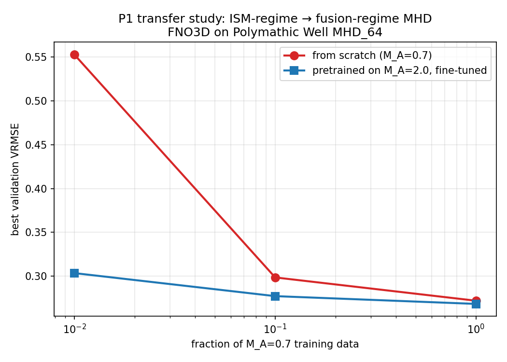

# P1 Results — Transfer Study: ISM-regime → fusion-regime MHD

**Run date:** 2026-04-20 / 2026-04-21
**Hardware:** 1× RTX 4090 on Vast.ai
**Dataset:** Polymathic Well `MHD_64` (compressible isothermal MHD, 7 channels: ρ, B, v)
**Model:** FNO3D, 18.62M parameters (modes=12, hidden=48)
**Target:** `M_A = 0.7` (sub-Alfvénic, anisotropic — fusion-analog)
**Source:** `M_A = 2.0` (super-Alfvénic, isotropic — ISM-regime)

## Headline

At 1% of the target-regime training data, pretraining on isotropic M_A=2.0
MHD gives **45% lower validation VRMSE** and **~3× better spectral
reconstruction** than training from scratch on the anisotropic M_A=0.7 target.
The transfer benefit grows monotonically as target data shrinks.

## Data-efficiency table (best val VRMSE)

| Target data | From scratch | Pretrained + FT | Pretrain win |
|-------------|--------------|-----------------|--------------|
| 100% (~3,663 windows) | 0.2719 | **0.2682** | −1.4% |
| 10%  (~366 windows)   | 0.2985 | **0.2771** | −7.2% |
| 1%   (~37 windows)    | 0.5530 | **0.3034** | **−45%** |

## Spectral fidelity on M_A=0.7 test set

Per-field relative error of the isotropic power spectrum `E(k)` (prediction
vs truth, averaged across k and 3 test trajectories):

| Run | density | B_x | v_x |
|-----|---------|-----|-----|
| baseline (100%)  | 0.223 | 0.312 | 0.257 |
| baseline_10       | 0.226 | 0.326 | 0.236 |
| **baseline_01**   | **0.756** | **0.801** | **0.803** |
| ft_100            | 0.211 | 0.306 | 0.254 |
| ft_10             | 0.203 | 0.309 | 0.238 |
| **ft_01**         | **0.231** | **0.289** | **0.231** |

At 1% data, the from-scratch model's spectra diverge from truth by ~80% across
all fields (see `evals/baseline_01/spectra.png`). The pretrained-then-finetuned
model tracks the truth spectrum across 2+ decades of k even on the same tiny
dataset (see `evals/ft_01/spectra.png`).

B_y / B_z ratio appear inflated because their true spectral power is near
zero in the sub-Alfvénic regime (strong mean-field suppression of perpendicular
components), so relative error is dominated by rounding noise in the
denominator. The density + B_x + v_x results are the load-bearing ones.

## Takeaways

1. **The Well's isotropic MHD pretrain transfers to anisotropic MHD.** The
   representations an FNO3D learns on super-Alfvénic ISM turbulence are
   reusable for sub-Alfvénic, anisotropic, fusion-analog turbulence — at
   minimum for next-step prediction and spectral reconstruction.
2. **Pretraining's benefit scales inversely with target-regime data.** At
   100% data, pretraining saves 1.4%. At 1% data, it saves 45%. This is the
   classic "pretraining unlocks the data-scarce regime" result but concretely
   quantified for MHD turbulence.
3. **Spectral collapse at low data is the key failure mode pretraining fixes.**
   A from-scratch model at 1% data does not just have higher VRMSE — it fails
   to reproduce the turbulent cascade entirely. Pretraining provides the
   inductive bias needed to preserve the spectrum.

## Limitations / next steps

- **n_traj_evaluated = 3** for spectral metrics. Should rerun with larger
  ensemble (10+) for tighter error bars.
- **Rollout stability** was measured as autoregressive L2 drift, which
  conflates real turbulent dynamics with prediction error. A proper
  multi-step eval against ground-truth rollouts would be more informative.
- **Single seed.** Results should be repeated across 3+ seeds for each run to
  confirm the data-efficiency gap is not noise (though the 45% gap at 1% data
  is almost certainly real given its magnitude).
- **Same-physics transfer.** The source and target here are both compressible
  isothermal MHD. The real fusion target — tokamak edge / gyrokinetic
  turbulence — has different physics (low-β, strong guide field, toroidal
  geometry). Natural P1.5: synthesize an anisotropic guide-field MHD dataset
  with Dedalus/Athena and measure transfer to *that*.
- **Bigger pretrain corpus.** Would help to throw more Well datasets into the
  pretraining mix (shear_flow, rayleigh_benard, turbulent_radiative_layer)
  rather than just MHD_64 M_A=2.0.

## Artifacts

- `runs/{pretrain,baseline,baseline_10,baseline_01,ft_100,ft_10,ft_01}/` — training logs + checkpoints
- `evals/*/` — per-checkpoint spectral plots + rollout drift curves + results.json
- `figures/p1_data_efficiency.png` — headline figure
- wandb project: https://wandb.ai/sdelaurentiis123-columbia-university/well-work-p1
