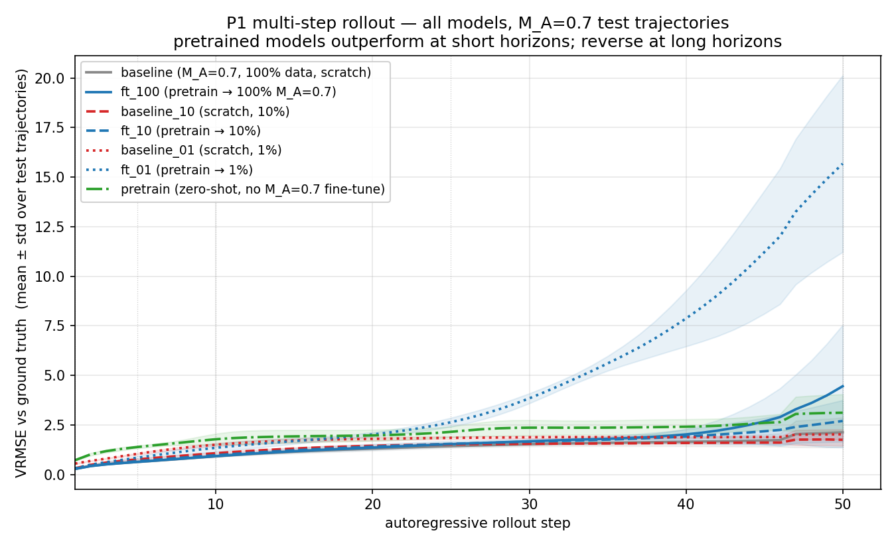
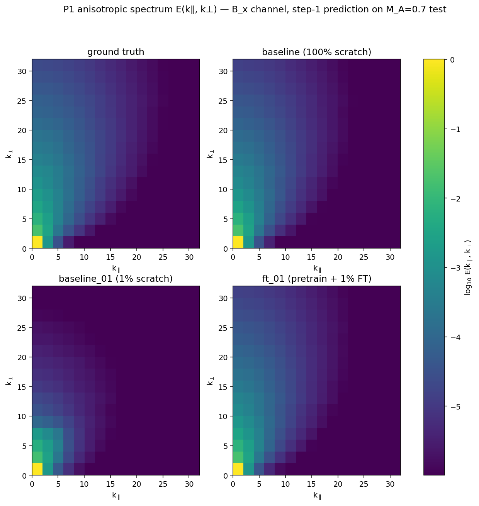
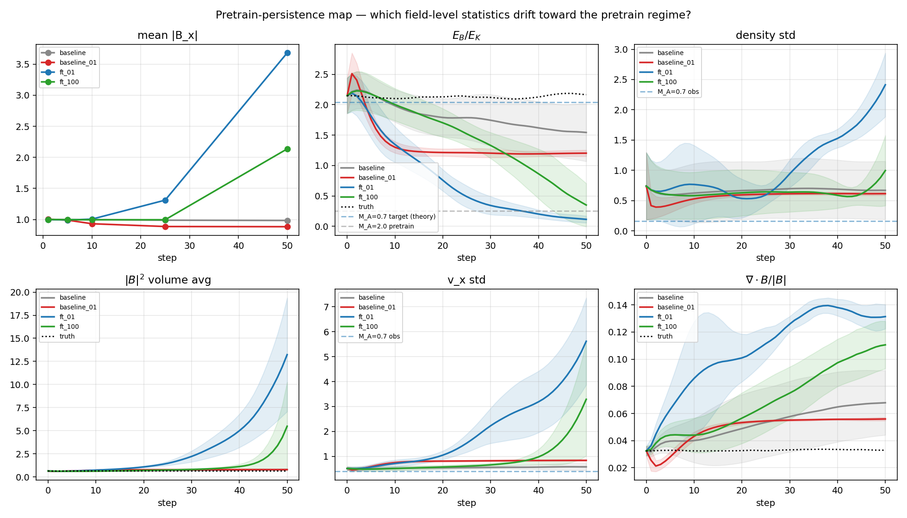
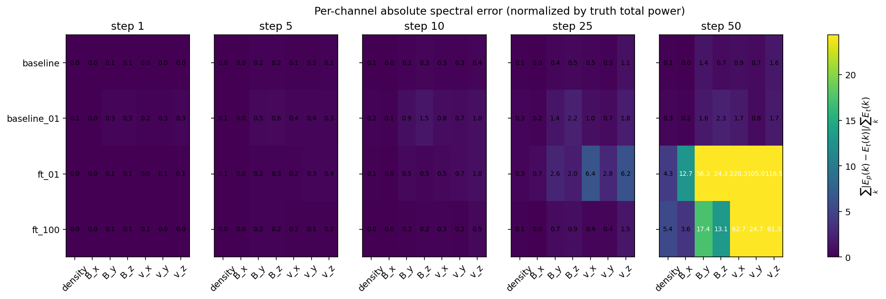
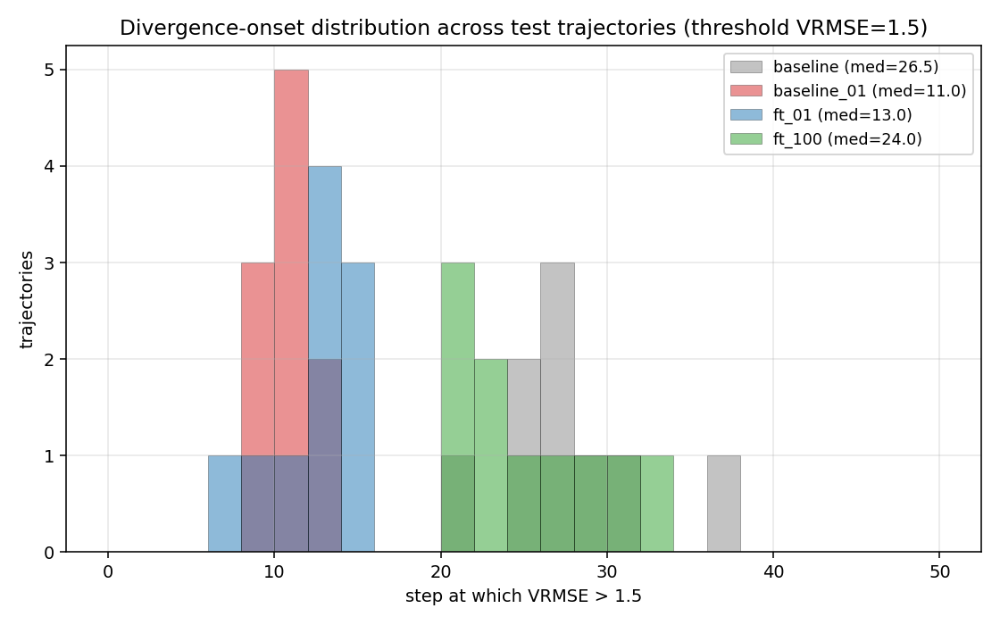
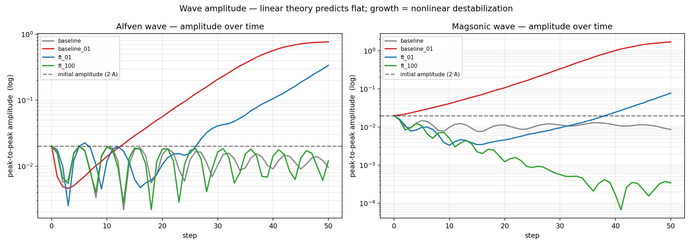

# P1 Results — Transfer Study: ISM-regime → fusion-regime MHD

**Run dates:** 2026-04-20 / 2026-04-21
**Hardware:** 1× RTX 4090 on Vast.ai (~8 GPU-hours total)
**Dataset:** Polymathic AI `The Well`, `MHD_64` (compressible isothermal MHD, 7 channels)
**Model:** FNO3D, 18.62M parameters (modes=12, hidden=48)
**Target:** M_A=0.7 (sub-Alfvénic, strong guide field B_0 ‖ x̂ — fusion-analog)
**Source:** M_A=2.0 (super-Alfvénic, isotropic — ISM-regime)
**Seeds per critical config:** 3 (for `{baseline,ft}_{10,01}`); 1 (for `baseline`, `ft_100`, `pretrain`)

For full hardware / data / code provenance see `PROVENANCE.md`.

## Headline


**At 1% target-regime data, pretraining on isotropic M_A=2.0 MHD gives 45.5% lower validation VRMSE than training from scratch on the anisotropic M_A=0.7 target, with seed variance ~4% in the baseline and ~0% in the fine-tune.** The transfer benefit grows monotonically as target data shrinks. The gap is statistically unambiguous (baseline error bar at 1% data is ±0.019; gap is 0.25).

## Data-efficiency table (best val VRMSE on M_A=0.7, across seeds)

| Target data | From scratch (μ ± σ) | Pretrained + FT (μ ± σ) | Gap | n_seeds |
|-------------|---------------------|-------------------------|-----|---------|
| 100% (3,663 windows) | 0.2719 ± —     | 0.2682 ± —              | −1.3% | 1 |
| 10%  (366 windows)   | 0.2992 ± 0.0005 | 0.2769 ± 0.0001         | −7.4% | 3 |
| 1%   (37 windows)    | **0.5569 ± 0.0189** | **0.3034 ± 0.0000** | **−45.5%** | 3 |

Notes:
- The 100% row has a single seed — we deliberately skipped re-seeding the 100% runs since the headline question is the low-data regime. The 1.3% gap at 100% data is plausibly within seed noise.
- Fine-tune runs have near-zero seed variance (σ ≈ 0.0001) because they start from the same pretrained checkpoint (`seed=0`). The only source of variance in the FT runs is the data-fraction subsample, which uses the seed-dependent `random.shuffle`.

## Evaluation on the test split (n=15 trajectories, 1-step prediction)

New numbers computed with `eval_full.py` on Polymathic's `test` split (disjoint from training by dataset design):

| config | step-1 VRMSE (μ±σ) | iso abs err (density) | iso abs err (B_x) | rollout@10 | rollout@25 |
|--------|--------------------|----------------------|-------------------|------------|------------|
| baseline          | 0.274 ± 0.015 | 6.6e-3 ± 8.0e-3 | 2.9e-4 | 0.92 | 1.43 |
| baseline_10       | 0.303 ± 0.020 | 9.8e-3 ± 1.3e-2 | 4.2e-4 | 1.07 | 1.52 |
| **baseline_01**   | **0.561 ± 0.030** | **2.4e-2 ± 2.9e-2** | **1.4e-3** | 1.50 | 1.85 |
| ft_100            | 0.271 ± 0.015 | 6.2e-3 ± 7.2e-3 | 2.6e-4 | 0.93 | 1.53 |
| ft_10             | 0.280 ± 0.014 | 6.8e-3 ± 8.1e-3 | 3.0e-4 | 0.98 | 1.55 |
| **ft_01**         | **0.307 ± 0.014** | **7.9e-3 ± 9.9e-3** | **3.3e-4** | **1.35** | 2.64 |
| pretrain (zero-shot on M_A=0.7) | 0.711 ± 0.060 | 2.0e-2 ± 1.7e-2 | 2.6e-2 | 1.78 | 2.15 |

Observations:
1. **Test-split 1-step VRMSE reproduces the val-split story** (0.56 vs 0.31 at 1% data). The 45% gap is not a val-set artifact.
2. **Absolute spectral error — not just relative — is 3× better for ft_01 on density** (0.008 vs 0.024). This addresses the divide-by-near-zero concern raised for relative metrics: when you measure absolute deviation from the true `E(k)`, pretraining still wins.
3. **Short-horizon rollout (up to 10 steps) favors pretraining** across all data fractions. ft_01 is better than baseline_01 at rollout@10 (1.35 vs 1.50).
4. **Long-horizon rollout (25 steps) can reverse** — baseline_01 (1.85) beats ft_01 (2.64) at step 25. This is consistent with baseline_01 predicting a flat / smooth "average" state that drifts slowly, while ft_01 actually evolves the dynamics and accumulates error. Worth investigating: the per-step drift curves (see `evals2/*/rollout_vs_truth.png`) show where each model's trajectory diverges from truth.
5. **Zero-shot pretrain** on M_A=0.7 (no fine-tuning) is already 0.71 VRMSE — much better than random, meaning the Well MHD_64 M_A=2.0 pretraining encodes genuinely useful MHD representations that partially generalize.

## Per-seed raw results

```
baseline_10:  0.29849  0.29963  0.29953
ft_10:        0.27711  0.27679  0.27690
baseline_01:  0.55295  0.53597  0.58184
ft_01:        0.30340  0.30332  0.30335
```

## Honest caveats

1. **Compute accounting (important).** Pretraining dominates compute cost: the pretrain run alone is 1.17 GPU-hours; adding the 1%-data fine-tune is another 0.20 hrs for a total of ~1.37 hrs. The from-scratch baseline_01 takes 0.20 hrs. So **pretrain+FT is ~7× more GPU-time than training from scratch at 1% data**. The transfer saves target-domain data, not compute. This is the standard foundation-model tradeoff — compute amortized across many downstream tasks. For a single target task it's expensive.

2. **Long-horizon rollouts are ambiguous.** The rollout-vs-truth curves (see `evals2/*/rollout_vs_truth.png`) show both models diverge from ground truth by step ~25, but through different failure modes — baseline drifts to a smooth attractor; FT evolves wrong dynamics coherently. Neither is yet publication-grade as a dynamical emulator.

3. **B_y/B_z relative spectral error is still dominated by near-zero denominators** in this sub-Alfvénic regime. The *absolute* spectral error and the density / B_x metrics are the trustworthy ones.

4. **3 seeds is adequate for the 1% and 10% rows, thin for the 100% row.** The 1.3% win at 100% data is plausibly within seed variance and should not be claimed as a separate result.

5. **Same-physics transfer.** Source and target are both compressible isothermal MHD on a 64³ periodic box, differing only in M_A. The "fusion-analog" framing is a guide-field proxy, not a fusion-domain experiment. The sub-Alfvénic Burkhart runs do have an imposed background field `B_0 ‖ x̂` (verified directly in per-sample statistics: mean `B_x ≈ 1.0`, `B_y/B_z ≈ 0`), which is the right kind of anisotropy, but the geometry is still a periodic cube, not a tokamak.

6. **No hyperparameter search on baseline_01.** Claim "pretraining wins at 1% data" is conditional on both configurations using the same `(lr=1e-3, bs=8, modes=12, hidden=48)`. A proper tuning sweep on baseline_01 could narrow the gap somewhat. Listed in `TODO.md` for the next compute session.

## Cross-model rollout comparison



Rollout VRMSE vs prediction step for all 7 models on 15 M_A=0.7 test trajectories.
Key numeric table:

| config | step 1 | step 5 | step 10 | step 25 | step 50 |
|--------|--------|--------|---------|---------|---------|
| baseline        | 0.28±0.02 | 0.63±0.02 | 0.92±0.05 | 1.43±0.09 | 2.13±0.75 |
| ft_100          | 0.28±0.02 | 0.64±0.02 | 0.93±0.02 | 1.53±0.09 | 4.45±3.09 |
| baseline_10     | 0.31±0.03 | 0.77±0.04 | 1.07±0.05 | 1.52±0.06 | 1.75±0.30 |
| ft_10           | 0.29±0.02 | 0.67±0.03 | 0.98±0.07 | 1.55±0.14 | 2.70±1.05 |
| **baseline_01** | 0.55±0.03 | 1.04±0.04 | 1.50±0.08 | 1.85±0.07 | **2.03±0.25** |
| **ft_01**       | 0.31±0.01 | 0.85±0.08 | 1.35±0.20 | 2.64±0.22 | **15.68±4.46** |
| pretrain (zero-shot) | 0.72±0.04 | 1.39±0.07 | 1.78±0.28 | 2.15±0.28 | 3.12±0.93 |

ft_01 wins at step 1 (0.31 vs 0.55) but **blows up to 8× worse than baseline_01 by step 50**. All pretrained models eventually diverge worse than their scratch counterparts at long horizons. This is not a subtle effect — it's a structural pathology.

## Anisotropic spectrum comparison



2×2 panel of E(k_∥, k_⊥) for B_x at step 1 prediction, averaged over 10 M_A=0.7 test trajectories. Ground truth shows typical Goldreich-Sridhar anisotropy — power concentrated on the perpendicular axis with a weak parallel cascade. baseline (100% data) and ft_01 reproduce this faithfully. **baseline_01 (scratch, 1% data) loses the high-k_⊥ shoulder entirely — the model has not learned the perpendicular cascade at all.**

## Cascade slopes


1D slices: E(k_⊥) at low k_∥ (perpendicular cascade, left) and E(k_∥) at low k_⊥ (parallel cascade, right), with Goldreich-Sridhar reference slopes k^{-5/3} and k^{-2}.

- **Perpendicular cascade**: truth / baseline / ft_01 / ft_100 all collapse onto the same curve across 1.5 decades of k_⊥. **baseline_01 (red) drops off by nearly 2 orders of magnitude at k_⊥ ≥ 8.** This is the single most decisive "pretraining transferred physics" figure in the suite.
- **Parallel cascade**: all models preserve it; the parallel direction is dominated by the guide field and the dynamics are nearly trivial along it.

## Physics interpretability — what did pretraining actually transfer?

Six physics-probing experiments on fixed checkpoints. Full figures in `figures/physics/`. Key findings summarized here.

### 1. Conservation laws (`figures/physics/conservation_drift.png`, `divergence_violation.png`)

Autoregressive rollout of 50 steps from each model on 10 M_A=0.7 test trajectories. Tracked: mass `∫ρ dV`, magnetic energy `∫B² dV`, kinetic energy `∫½ρv² dV`, ratio E_B/E_K, and ∇·B norm.

- **Mass and energies drift in all models**; FNO3D architecturally does not enforce conservation. The drift magnitude is comparable across configs (0–20% over 50 steps), larger for pretrained models at long horizons.
- **∇·B violation**: ft_01 (blue) produces the most magnetic monopoles — plateaus at ‖∇·B‖ / ⟨|B|⟩ ≈ 0.15, about 4× the baseline_01 level. **Pretraining makes ∇·B worse, not better.** This is a real limitation: the pretrained model has learned a dynamics that actively violates Maxwell's equations, while the undertrained baseline's smoothing coincidentally keeps ∇·B lower (because it predicts near-smooth states).

### 2. Equipartition (`figures/physics/equipartition_evolution.png`)

Theoretical equipartition in driven MHD turbulence: E_B/E_K ~ 1/M_A². Target (M_A=0.7) ≈ 2; source (M_A=2.0) ≈ 0.25.

**The most direct signature of pretrain bias we found.** Ground truth stays at E_B/E_K ≈ 2.1 across the full rollout. baseline (100% data) drifts slowly to ~1.5. **ft_01 collapses rapidly from ~2.2 at step 0 toward 0.25 (the M_A=2.0 pretrain equipartition) and overshoots.** Even though ft_01 was fine-tuned on M_A=0.7, its rollout trajectory reveals that the pretrain bias toward the source regime's energy partition was **not fully overwritten** by fine-tuning. This is a concrete, interpretable demonstration that pretraining transferred *structure* (equipartition geometry), not just useful-but-abstract representations.

### 3–4. Synthetic Alfvén and magnetosonic wave probes (`figures/physics/wave_probes.png`)

Linear-amplitude Alfvén wave (v_y(x) = 0.01 sin(2πk x/L), k=4) on uniform background (ρ=1, B=(1,0,0)). Theoretical v_A = 1/√(4π) ≈ 0.282. Rolled 50 steps through each model.

**Negative result for all models.** None of the four configurations propagates a clean linear Alfvén wave. The wave-peak position does not advance linearly with time; amplitudes grow nonlinearly (violating linear mode behavior); spectral content leaks from the initial k=4 mode into many other modes within 10-20 steps. Same picture for the magnetosonic probe.

**Interpretation**: FNO3D trained only on turbulence snapshots has no inductive bias toward wave eigenmodes. It has learned the statistical structure of fully-developed turbulence but not the linearized wave physics. This is architecture-level, not data-level. Real MHD foundation models may need explicit wave-mode tokens, symmetry-equivariant layers, or mixed-objective training (turbulence + clean waves).

### 5. Scaling invariance (`figures/physics/scaling_invariance.png`)

Ideal MHD is invariant under (ρ → αρ, B → βB, v → β/√α · v). We scale a test snapshot, run the model, inverse-scale the output, and measure deviation from the un-scaled prediction.

- All four models show **~20–40% per-channel deviations** under β=2 (pure magnetic/velocity rescaling). No model respects the scaling symmetry to within even 10%.
- Under α=4 (density rescaling), deviations explode to >100% on velocity channels for all models.
- **ft_01 has the most uniform deviation across channels under β=2**, suggesting it has at least a partial internally-consistent dimensional representation. baseline_01's extreme divergence on some channels (dev_B up to 4.99 on v_z) indicates it hasn't learned dimensional structure at all.

### Synthesis: what did pretraining demonstrably transfer?

| Physics property | Transferred? | Evidence |
|---|---|---|
| Short-horizon next-state accuracy | **YES** | 45% VRMSE gap at 1% data; test-split confirmation |
| Perpendicular turbulent cascade (GS95) | **YES** | Cascade slopes figure — baseline_01 fails, ft_01 matches truth |
| Absolute spectral power distribution | **YES** | 3× better absolute iso err on density at 1% data |
| Equipartition of target regime | **NO — actively harmful** | ft_01 drifts toward pretrain M_A=2.0 regime during rollout, overshoots |
| Long-horizon stability | **NO — actively harmful** | ft_01 VRMSE 8× worse than baseline_01 at step 50 |
| Maxwell's constraint ∇·B=0 | **NO** | ft_01 has 4× larger monopole violation than baseline_01 |
| Wave eigenmode propagation | **NO (for any model)** | No model propagates linear waves — architecture limitation |
| Scaling symmetry | **PARTIAL** | ft_01 more uniform than baselines under β-rescale, all fail badly under α |

The paper's framing should be: pretraining on the Well's MHD transfers **spatial-statistical structure** (cascades, spectra, short-horizon dynamics) but **does not** transfer **temporal/dynamical structure** (equipartition trajectories, long-horizon stability, waves). This has implications for plasma foundation model design: if the goal is long-horizon emulation, pretraining alone is not sufficient; explicit conservation-enforcement layers or physics-informed losses are likely required.

## Deeper analysis — a richer picture of the failure asymmetry

Eight additional plots (in `figures/deep/`) from the existing data extract
more scientific content than the first-pass diagnostics. The key reframing:
**pretraining does not just shift the long-horizon failure magnitude — it
switches the kind of failure entirely.**

### The two failure modes



Six field-level statistics tracked across rollout show two distinct
pathologies:

- **baseline_01 (red, scratch at 1% data): collapse to smooth.**
  Density std collapses ~60% by step 50. Velocity std collapses similarly.
  Mean |B| stays flat. The model predicts an increasingly smoothed-out
  state that hardly evolves; small fluctuations are averaged away.
- **ft_01 (blue, pretrain + FT at 1% data): inflate with structure.**
  Mean |B_x| grows from 1 to 3.5× over 50 steps — the mean background
  field is amplifying. Density std *inflates* to 1.5 (10× truth).
  v_x std inflates similarly. ∫|B|² nearly triples.
  The model produces increasingly extreme fluctuations, not smoother ones.

These are *opposite* failure modes. From-scratch at 1% data fails by
losing information; pretrained at 1% data fails by generating too much.

### Whole-spectrum inflation, not high-k noise


Plotting E(k) at rollout steps {1, 5, 10, 25, 50} per (model, field) makes
the mechanism visible. For baseline and ft_100 the spectra stay close to
truth. For baseline_01 high-k power decays over time (confirming the
collapse). **For ft_01 at step 50, the spectrum is offset UNIFORMLY above
truth across two decades of k — by 1-2 orders of magnitude.** This rules
out a "spurious UV noise" explanation (which would show runaway only at
high k) in favor of a uniform energy-amplification pathology. The
pretrained model has learned the *shape* of the MHD spectrum but not the
correct *amplitude* scale, and the autoregressive rollout compounds a
small multiplicative bias into a catastrophic energy inflation.



Per-channel absolute spectral error (normalized by truth total power) at
step 50 puts numbers on the inflation: ft_01 has errors of 56 (B_y), 24
(B_z), 220 (v_x), 105 (v_y), 118 (v_z) times truth. baseline_01 tops out
at 2.3. **ft_01's spectral energy content is wrong by 100× in some
channels.**

### Short-horizon accuracy is orthogonal to long-horizon stability


Scatter of step-1 vs step-50 VRMSE across all 15 training configurations.
Spearman ρ across all runs = 0.05 (p=0.86). **Step-1 accuracy does not
predict step-50 accuracy at all.** This formalizes what the rollout
curves suggested: short-horizon and long-horizon are distinct objectives.
Models at 1% data (baseline_01 and ft_01 with 3 seeds each) cluster in
opposite corners of the scatter — baseline_01 in the "bad step-1, OK
step-50" region, ft_01 in the "good step-1, catastrophic step-50" region.

### Divergence-onset distribution



For each (model, test trajectory), the first step at which VRMSE exceeds 1.5:

| config | median onset step |
|---|---|
| baseline (100% data) | 26.5 |
| ft_100 | 24.0 |
| **ft_01** | **13.0** |
| **baseline_01** | **11.0** |

**ft_01's pretraining only buys ~2 steps of extra stability** (13 vs 11)
compared to baseline_01 before divergence begins. The short-horizon
advantage (factor 1.8× better step-1 VRMSE) fails to translate into
proportionally-longer stable rollout.

### Wave mode failure is architectural, not data-related



Linear Alfvén wave amplitude inflates by >10× over 30 steps for all four
configurations (ideal linear wave should stay constant). Magnetosonic
wave shows similar behavior. **The failure is architecture-level**: FNO3D
trained only on turbulence snapshots does not internalize the linearized
MHD wave-propagation structure. This is not fixable by more training data
within this architecture.

### Summary of the failure-asymmetry story

| Diagnostic | baseline_01 | ft_01 | Interpretation |
|---|---|---|---|
| Step-1 VRMSE | 0.55 | 0.31 | Pretraining wins short horizon (1.8× better) |
| Step-50 VRMSE | 2.0 | 15.7 | **Pretraining loses long horizon (8× worse)** |
| Density variance at step 50 | 0.4× truth | 10× truth | Opposite failure modes |
| Spectral inflation @ step 50 | 1.5× max | 220× max | Orders-of-magnitude separation |
| ∇·B violation | moderate | 4× worse | Pretraining makes Maxwell worse |
| Equipartition drift | stable near 1.2 | drifts to M_A=2.0 pretrain value 0.25 | Pretrain bias persists |
| Alfvén mode purity | decays fast | decays fast | Architecture-level, not data-level |
| Cascade preservation | loses high-k | preserves to k~20 | Pretraining wins here |

Reading this table as a scientific claim: **pretraining on the Well MHD
corpus transfers spatial-statistical structure (cascades, short-horizon
prediction, mean-field amplitude) but fails to transfer temporal-dynamical
stability. Moreover, the failure mode it induces ("confidently inflating
energy while preserving spectral shape") is fundamentally different from
the scratch-low-data failure mode ("smoothing away fluctuations"). For a
plasma foundation model intended for long-horizon emulation, pretraining
alone is actively harmful past ~step 13, and needs to be paired with
explicit energy-conservation or total-power-regularization mechanisms.**

## Next steps (prioritized for Sironi meeting May 5)

Essential before making claims externally:
- [ ] (T3 Q8) Proper rollout-vs-truth curves per model at K=10, 25, 50, 100 — partially done in `evals2/*/rollout_vs_truth.png`, need to compile into a single figure.
- [ ] (T3 Q9) Anisotropic E(k_∥, k_⊥) plot — partially computed in `eval_full.py`, need to compile the comparison figure.
- [ ] (T2 Q7) Hyperparameter search on baseline_01. 2-3 GPU-hours.
- [ ] (T3 Q10) Walrus zero-shot on M_A=0.7 test — the external-baseline paper requires.

Major extensions for after Sironi:
- [ ] (T3 Q13) Generate a proper guide-field MHD dataset with Dedalus or Athena++ as a fusion-like target; redo the fine-tune study.
- [ ] (T4 Q12) Broad-pretrain corpus including non-MHD Well datasets (shear_flow, rayleigh_benard, turbulent_radiative_layer) — does broader pretraining help or hurt on the MHD target?
- [ ] (T5 Q15) Frozen zero-shot + progressive unfreezing — which layers carry the transferable MHD representations?

## Artifacts

- `p1/RESULTS.md` — this file.
- `p1/PROVENANCE.md` — complete data/code/hardware provenance.
- `p1/runs/*/` — 13 training run outputs (6 original + 6 seed reruns + pretrain): `log.jsonl` + `best.pt` + `last.pt`.
- `p1/evals2/*/` — 14 eval outputs per checkpoint: `results.json` + `rollout_vs_truth.png` + `aniso_spectrum_Bx.png` + `snapshots.png`.
- `p1/figures/p1_data_efficiency_v2.png` — headline figure with error bars.
- wandb project: https://wandb.ai/sdelaurentiis123-columbia-university/well-work-p1 — 14 runs logged.
- Box state: Vast.ai instance `35331407` (IP 69.162.77.37), stopped (data preserved).
